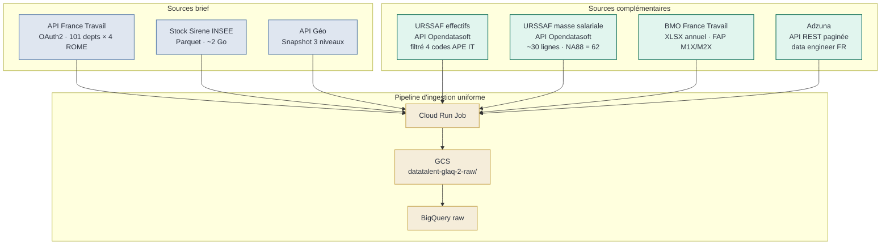
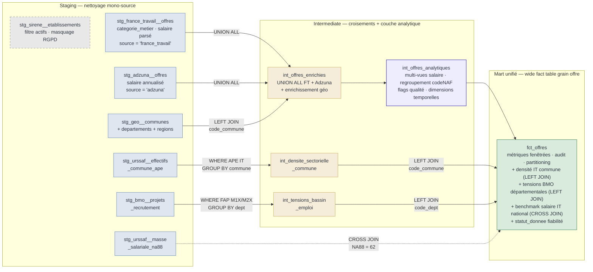
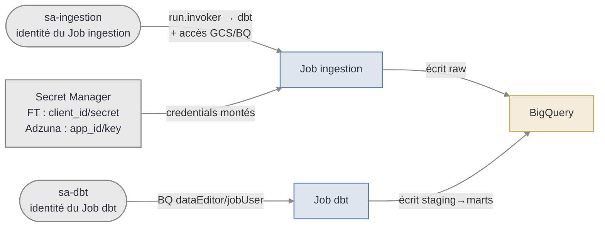
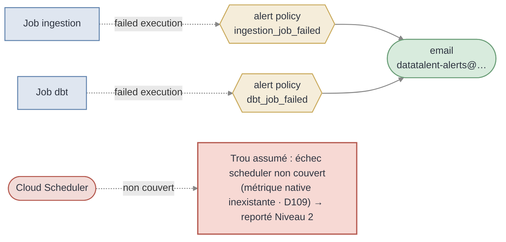
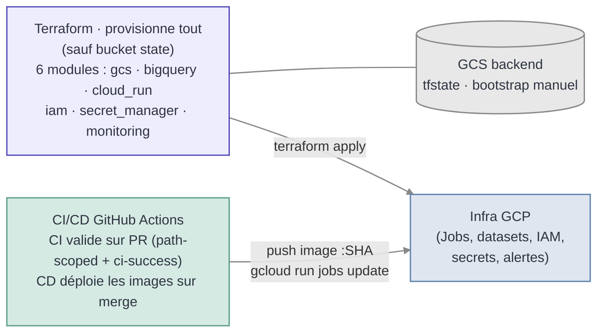

# Architecture — DataTalent

Trois vues complémentaires du pipeline, chacune lisible indépendamment :
acquisition des données, transformations dbt, infrastructure et déploiement.
Pour une vue d'ensemble du projet, voir le [README](../README.md).

> Les diagrammes ci-dessous sont au format Mermaid, rendu nativement par GitHub.

---

## 1. Acquisition des données

Un seul chemin d'ingestion : les 7 sources passent par Cloud Run → GCS →
BigQuery `raw`. Aucune exception.

**Points clés :**

- Chaque source suit le même chemin : script Python dans `ingestion/{source}/` →
  `shared/gcs.py` → `shared/bigquery.py` → `raw`.
- France Travail et Adzuna utilisent `WRITE_APPEND` (accumulation hebdomadaire,
  déduplication en staging). Les autres sources utilisent `WRITE_TRUNCATE`.
- URSSAF masse salariale (~30 lignes) passe par le workflow classique malgré son
  faible volume, par souci d'uniformité architecturale.

---

## 2. Transformations dbt

Une couche analytique partagée (`int_offres_analytiques`) isole les dérivées métier
au grain offre, et un mart unifié (`fct_offres`) dénormalise les enrichissements
territoriaux pour servir Looker Studio en table large.

**Points clés :**

- `int_offres_enrichies` reste minimaliste : UNION ALL France Travail + Adzuna +
  enrichissement géographique.
- `int_offres_analytiques` (en violet) porte les dérivées analytiques partageables au
  grain offre (multi-vues salaire, regroupement par code NAF, flags qualité,
  dimensions temporelles). Couche d'isolation entre logique métier et logique de
  présentation.
- `fct_offres` (mart unifié) est la **seule table consommée par Looker Studio**. Elle
  combine les dérivées analytiques, les métriques fenêtrées (que Looker ne peut pas
  calculer), les enrichissements territoriaux dénormalisés et les flags de fiabilité.
- `stg_sirene__etablissements` (grisé) est maintenu comme livrable technique mais ne
  participe à aucune jointure : le SIRET est absent des offres, la jointure Sirene a
  été abandonnée.

---

## 3. Infrastructure et déploiement

Les composants transverses qui font tourner le pipeline. L'intégralité est
provisionnée par Terraform, à l'exception du bucket de state (bootstrap problem).
Quatre vues complémentaires : le flux d'exécution nominal, puis trois focus
transverses (sécurité, monitoring, déploiement) qui partagent le même squelette.

### 3.1 Flux d'exécution nominal

```mermaid
flowchart LR
    CS(["Cloud Scheduler<br/>lundi 6 h"])
    CR["Job ingestion<br/>main.py · 7 sources"]
    GCS["GCS<br/>landing zone"]
    RAW["BigQuery<br/>raw"]
    DBT["Job dbt<br/>dbt build"]
    MARTS["BigQuery<br/>marts · fct_offres"]
    DASH(["Looker Studio<br/>dashboard"])

    CS -->|"HTTP trigger"| CR
    CR -->|"upload"| GCS
    GCS -->|"load"| RAW
    CR -->|"invoque (si critiques OK)"| DBT
    RAW --> DBT
    DBT -->|"build"| MARTS
    MARTS --> DASH

    linkStyle default stroke:#888,stroke-width:1.5px
    classDef trig fill:#f2dbd8,stroke:#b55a50,stroke-width:1.5px,color:#2e3440
    classDef proc fill:#dfe6f0,stroke:#5e81ac,stroke-width:1.5px,color:#2e3440
    classDef store fill:#f5edda,stroke:#c9a95a,stroke-width:1.5px,color:#2e3440
    classDef out fill:#d8ebdd,stroke:#6b9e78,stroke-width:1.5px,color:#2e3440

    class CS trig
    class CR,DBT proc
    class GCS,RAW,MARTS store
    class DASH out
```

### 3.2 Focus — Sécurité et habilitation

Chaque Job a sa propre identité (`sa-ingestion`, `sa-dbt`) — séparation des
privilèges runtime (D60). Seuls France Travail et Adzuna ont des credentials,
isolés dans Secret Manager ; les autres sources sont des API ouvertes. ADC en
dev local (D27).

### 3.3 Focus — Monitoring et robustesse

Deux alert policies natives Cloud Run (`ingestion_job_failed`, `dbt_job_failed`)
routées vers un notification channel email (D105/D106). L'échec du Scheduler n'a
pas de métrique native (D109) — trou documenté, reporté en Niveau 2 log-based.

### 3.4 Focus — Déploiement (IaC + CI/CD)

**Points clés :**

- Cloud Scheduler déclenche le Job ingestion chaque lundi à 6 h. `main.py` exécute
  l'ingestion puis **invoque le Cloud Run Job dbt séparé via `run_job()`** (cross-Job,
  fire-and-forget), conditionnellement à la réussite des sources critiques
  `france_travail` / `adzuna`. Le Job dbt exécute `dbt build`.
- BigQuery héberge les **4 datasets Medallion** (`raw`, `staging`, `intermediate`,
  `marts`) consommés par le pipeline, plus deux datasets annexes hors flux
  analytique : `marts_archive` (marts historiques figés) et `billing_export`
  (monitoring des coûts).
- Terraform provisionne l'intégralité de l'infra (6 modules), sauf le bucket de state
  — seule ressource gérée manuellement (bootstrap problem).
- **Monitoring :** 2 alert policies natives Cloud Run (`ingestion_job_failed`,
  `dbt_job_failed`) routées vers un notification channel email. L'alerte sur le
  Scheduler n'est pas couverte en natif (métrique inexistante côté Cloud Monitoring) ;
  elle est reportée à une extension log-based.
- **CI/CD :** `ci.yml` valide sur PR (agrégé via le check `ci-success`,
  path-scoped) ; deux workflows CD séparés (`cd-ingestion.yml`, `cd-dbt.yml`)
  déploient les images sur merge.
- Les variables `GCP_PROJECT_ID` / `GCP_REGION` sont injectées par Terraform dans le
  Job ingestion pour permettre l'invocation cross-Job.

---

> **Source des diagrammes :** ces vues sont maintenues en cohérence avec le code de
> `infra/` et `dbt/`. En cas de divergence, le code fait foi.
